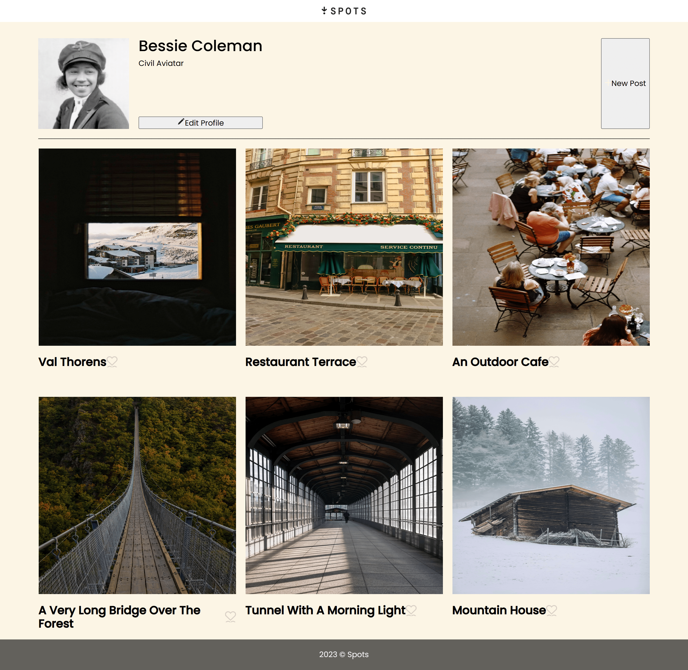
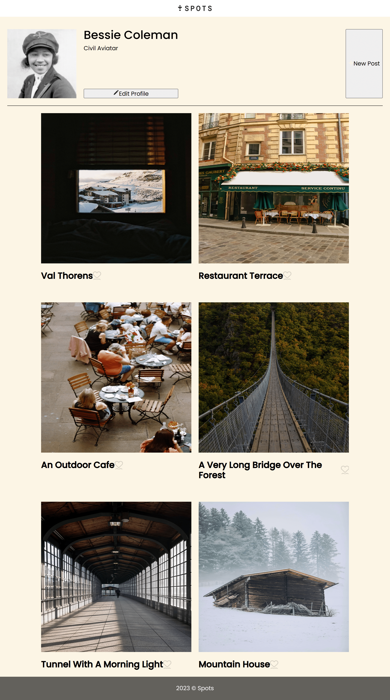

# 📸 Spots — Responsive Webpage (Stage 2)

A responsive layout built from a Figma design for a future photo-sharing application.

## 📌 Project Overview

This project is Stage 2 of the Spots application — an interactive image-sharing platform that will later include features such as adding photos, liking photos, and editing user profiles.

The goal of this stage is to create a fully responsive webpage based on the provided Figma designs for desktop (1440px), tablet, and mobile (320px). The layout adjusts smoothly across all screen sizes with no horizontal scrolling and includes hover effects and text-overflow handling.

# 🎯 Key Features
## ✅ Responsive Design

* Desktop: 3-column grid
* Tablet: 2-column grid
* Mobile: 1-column grid
* Max content width capped at 1280px
* 20px padding on sides of <main>

## ✅ Profile Section

* User avatar
* Name & description
* Edit and Add buttons
* Three-line text clamp for long profile text

## ✅ Image Card Layout

* Responsive CSS Grid
* Hover zoom effect on images
* Like button with hover animation
* One-line ellipsis for long card titles

## ✅ Footer

Clean footer with semi-transparent background that stays consistent across all screen sizes.

## 🛠️ Technologies & Techniques Used

* HTML5
* Semantic structure for header, profile, cards, and footer
* CSS3
* Responsive design with Grid and Flexbox
* Media queries for tablet & mobile layouts
* minmax() & 1fr fractions for flexible grids
* text-overflow: ellipsis for 1-line clamps
* -webkit-line-clamp for 3-line profile truncation
* Hover states using transition, opacity, and transform
* BEM methodology for organized class naming

## Additional Tools

* Normalize.css
* Google Fonts (Poppins)
* GitHub Pages for deployment
* Figma for design interpretation

## 🖼️ Screenshots

* Desktop Layout

* Tablet Layout

* Mobile Layout

## 🌐 Live Project on GitHub Pages

View the deployed project here:
🔗 

## 🎥 Project Pitch Video

Check out the project walkthrough and explanation:
🔗 https://www.loom.com/share/2472b5b5489145f685aa84b503ed70dd

## 🗂️ Figma Design Reference

Figma design used for this project:
🔗 https://www.figma.com/file/BBNm2bC3lj8QQMHlnqRsga/Sprint-3-Project-%E2%80%94-Spots?type=design&node-id=2%3A60&mode=design

## 📁 Images

Images were exported directly from Figma and optimized using TinyPNG:
🔗 https://tinypng.com/

## 🙌 Conclusion

This project establishes the complete responsive layout foundation for the Spots application. Future stages will build on this by adding JavaScript interactivity, enabling users to add, remove, and like photos and update their profile information.