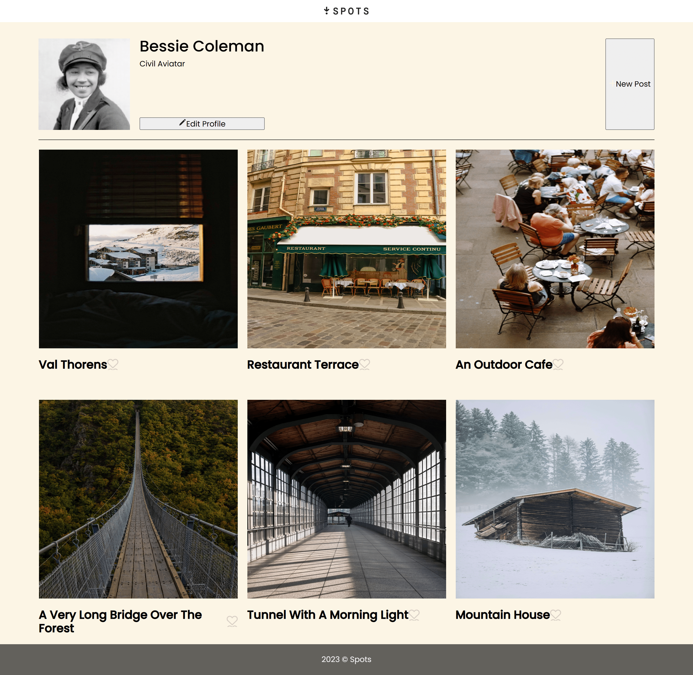
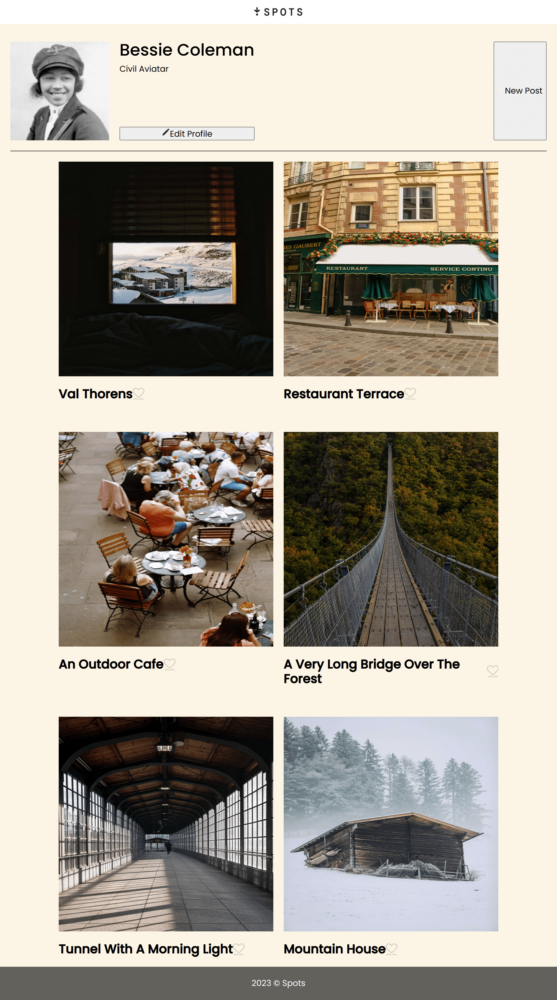
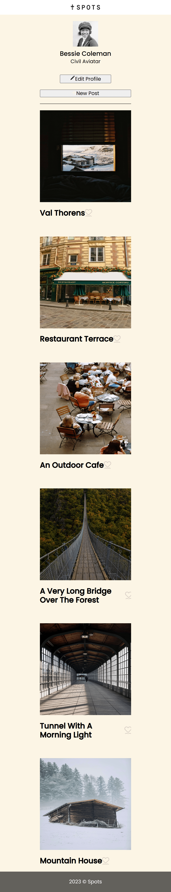

# 📸 Spots — Responsive Webpage (Stage 2)

A responsive layout built from a Figma design for a future photo-sharing application.

## 📌 Project Overview

This project is part of the Spots application — an interactive image-sharing platform that evolves across multiple stages.

Stage 2 focuses on building a fully responsive webpage based on the provided Figma designs for desktop (1440px), tablet, and mobile (320px).

Stage 6 (Sprint 6 — Form Validation & UX Improvements) builds on this foundation by adding JavaScript functionality, including form validation, improved modal behavior, and enhanced user experience.

The layout adjusts smoothly across all screen sizes with no horizontal scrolling and includes hover effects, text-overflow handling, and interactive validation logic.

# 🎯 Key Features

## ✅ Responsive Design

* Desktop: 3-column grid
* Tablet: 2-column grid
* Mobile: 1-column grid
* Max content width capped at 1280px
* 20px padding on sides of <main>

## ✅ Profile Section

* User avatar
* Name & description
* Edit and Add buttons
* Three-line text clamp for long profile text

## ✅ Image Card Layout

* Responsive CSS Grid
* Hover zoom effect on images
* Like button with hover animation
* One-line ellipsis for long card titles

## ✅ Footer

* Clean footer with semi-transparent background that stays consistent across all screen sizes.

# 🚀 NEW — Stage 6: Form Validation & UX Improvements

## ✅ Form Validation System

* Real-time validation using JavaScript
* Uses browser’s built-in validation messages
* Modular validation logic (validation.js)
* Configuration-based setup for scalability

## ✅ Input Validation Rules

* Edit Profile Form

* Name: 2–40 characters
* Description: 2–200 characters

New Card Form

* Image Link: must be a valid URL
* Caption: 2–30 characters

## ✅ Error Handling

* Individual error message per input
* Errors hidden by default
* Shown dynamically when invalid
* Red input styling for invalid fields

## ✅ Submit Button Behavior

* Disabled when inputs are invalid
* Automatically enabled when valid
* Visual disabled state applied

## ✅ Form Reset Logic

* Edit form resets when modal opens (clean + prefilled)
* Card form resets only after submission
* Prevents empty submissions

## ✅ Modal UX Improvements

* Close modal by clicking overlay (outside modal)
* Close modal using Escape key
* Event listeners added/removed properly (no memory leaks)

# 🛠️ Technologies & Techniques Used

* HTML5
* Semantic structure for header, profile, cards, and footer
* CSS3
* Responsive design with Grid and Flexbox
* Media queries for tablet & mobile layouts
* minmax() & 1fr fractions for flexible grids
* text-overflow: ellipsis for 1-line clamps
* -webkit-line-clamp for 3-line profile truncation
* Hover states using transition, opacity, and transform
* JavaScript (ES6)
* DOM manipulation
* Event handling
* Event bubbling
* Form validation API
* Modular function architecture
* Configuration objects
* BEM methodology for organized class naming
* Additional Tools
* Normalize.css
* Google Fonts (Poppins)
* GitHub Pages for deployment
* Figma for design interpretation

# 🖼️ Screenshots

* Desktop Layout

* Tablet Layout

* Mobile Layout

# 🌐 Live Project on GitHub Pages

## View the deployed project here:

🔗 https://kevinh5748.github.io/se_project_spots/

# 🎥 Project Pitch Videos

## 📌 Stage 2 Video

🔗 https://www.loom.com/share/2472b5b5489145f685aa84b503ed70dd

## 🚀 Stage 6 Video (Form Validation & UX)

🔗 https://www.loom.com/share/99e618e78ec44f4f8c1d28404a4b90f0

🗂️ Figma Design Reference

Figma design used for this project:
🔗 https://www.figma.com/file/BBNm2bC3lj8QQMHlnqRsga/Sprint-3-Project-%E2%80%94-Spots?type=design&node-id=2%3A60&mode=design

📁 Images

Images were exported directly from Figma and optimized using TinyPNG:
🔗 https://tinypng.com/

## 🙌 Conclusion

This project establishes both:

🎨 A complete responsive UI foundation
⚙️ A fully functional validation and UX system

Stage 6 represents a major transition from static layouts to interactive frontend engineering, demonstrating real-world skills such as validation logic, event handling, and user experience design.

Future stages will continue building on this by adding more advanced interactivity and application logic
